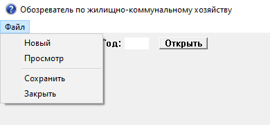
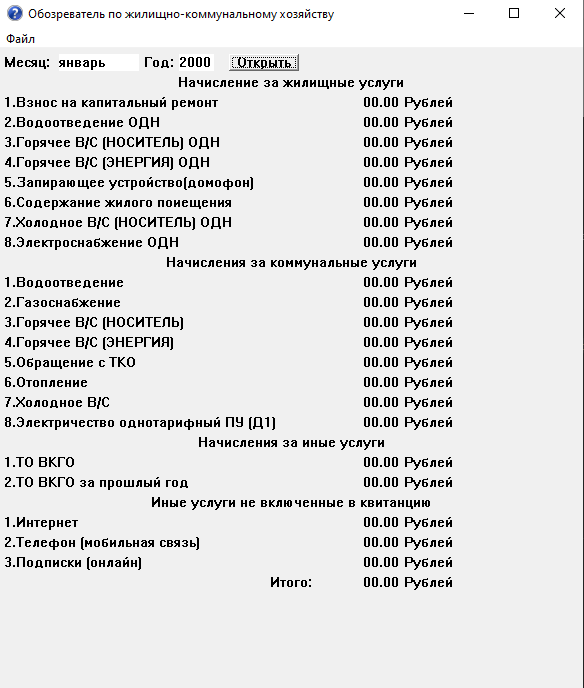

# ***Обозреватель по жилищно-коммунальному хозяйству***

### Описание программы
---
Данный обозреватель позволяет отслеживать расходы за жилищно-коммунальные и иные услуги за конкретный месяц *(вид программы создан по ЕПД Московской области и Москвы)*.

>Программа находится в свободном доступе, будет постепенно дополняться и оптимизироваться.

Ниже прилагается инструкция c описанием структуры и функционала для корректной работы.

# Инструкция

## Начало работы:

При первом запуске программы доступен ввод месяца и года, а также создаётся папка для хранения данных. По умолчанию открывается режим записи (соответсвует меню -> `Новый`), его можно переключить в меню `Файл`.

## Меню:

1. Новый
   > Открывает доступ для записи в рабочей области.
1. Просмотр
   > Выводит для просмотра данные указанного месяца. (Если содержимое даты не заполнено в буфере, то значения будут `00.00`)
1. Сохранить
   > Сохраняет все данные из буфера в файл(-ы).
1. Закрыть
   > Зарывает текущее окно, возвращает доступность ввода полей `Месяц` `Год`, если они были заблокированы для изменения.

## Кнопка `Открыть`:

Открывает рабочую область привязанную к указанной дате. Если выбрано меню -> `Новый`:
>рабочая область будет доступна для изменения, а дата и месяц будут заблокированы.

Если выбрано меню -> `Просмотр`:
>рабочая область будет заблокирована для изменения, а дата и месяц будут доступны.

## Поле записи:

### **вид новой записи:**

### **вид просмотра записи:**

## Кнопка `Записать`:

Записывает введённые данные в буфер, привязанный к дате, в последующем его можно перезаписать через меню -> `Новый`. Если не заполнять поля, то значения будут автоматически обнуляться (`00.00`) 

---

## Изменения и версии:

- ***Версия `v.1.01-a`(от 01.10.2024):***
  - Добавлено:
  > - Независимый регистр: Теперь вводить месяц можно любого вида: `январь` `ЯНВАРЬ` `ЯнВАрЬ` будут восприниматься правильно.
  > - При первом запуске создаётся папка для хранения данных.
  - Изменения:
  > - Поле `Год` теперь позволяет записывать только цифры.
  > - При записи и сохранении все пустые ячейки обнулятся `00.00`.
  > - Исправленна ошибка подсчёта `Итого`, теперь каждый месяц считается корректно

- ***Версия `v.1.00-a`(от 30.09.2024):***
  > Релиз алфа версии `v.1.00 - alpha ru`.

---
## Обратная связь:

Ваши пожелания присылайте на почту: ***не указано***
